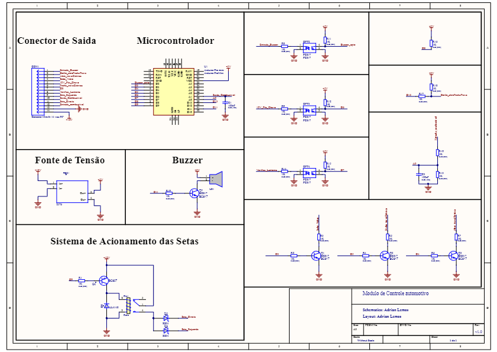

# Adicional_de_Alarme_Auto

Projeto de um Adicional para alarme automotivo, que lê a quantidade de pulsos do Alarme e toma uma decisão.

# Recursos

- 1 pulso  - Fecha as Travas eléticas, Pisca a Seta e sobe o Vidro
- 2 pulsos - Abre a Trava elétrica e Pisca a Seta duas vezes
- 3 pulsos - Não faz nada.
- Identifica se o Farol esta ligado e sem o Pós chave emite som de alerta

# Schematico

# Placa de Circuito Impresso

# Revisões

## v1.0.2
Modificação do Layout para a inclusão dos diodos schottky D2, D3, circuito de acionamento da buzzer, modificação do circuito de acionamento do Rele. 

## v1.0.1
Placa com correção nas medidas do Tamanho para que possam caber na Caixa Patola CP-021

## v1.0.0
Placa inicial feita na JLCPCB com alguns erros de projetos pegos na produção
