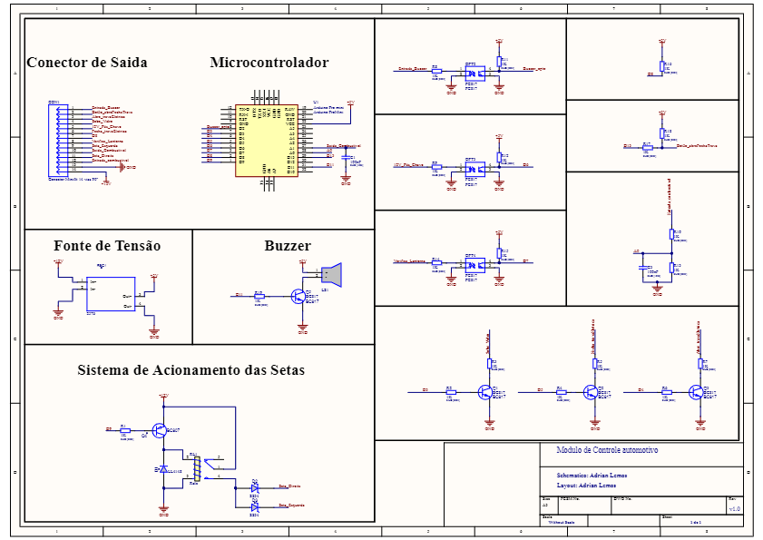
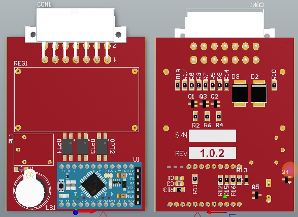
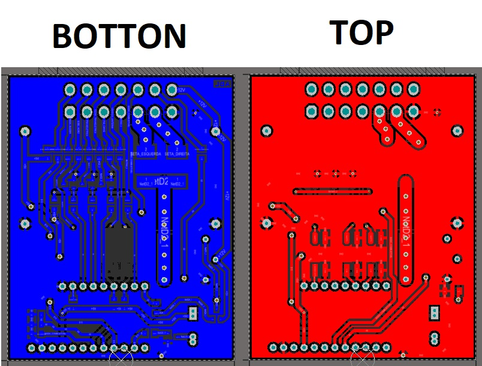

## Select the Language: | [Portuguese](./README.md) | English | [Spanish](./README_es.md) |

# Additional Car Alarm

Project of an Additional for automotive alarm, which reads the number of alarm pulses and makes a decision.

## Purpose and Motivation of the Project.

# Features

- 1 pulse - Close the Electric Locks, Flash the Arrow and raise the Window
- 2 pulses - Opens the Electric Lock and Flashes the Arrow twice
- 3 or more pulses - Does nothing.
- Identifies if the Lighthouse is on and without the Post key it emits an alert sound

# BOM

# Schematic

# 3D Vision to the PCB

# Layout of PCB

# Revision 

* v1.0.2 - 
Layout modification for the inclusion of schottky diodes D2, D3, buzzer activation circuit, modification of the Relay activation circuit.

* v1.0.1 - 
Plate with correction of the Size measurements so that they can fit in the CP-021 Patola Box

* v1.0.0 - 
Starter board made at JLCPCB with some design errors caught in production
